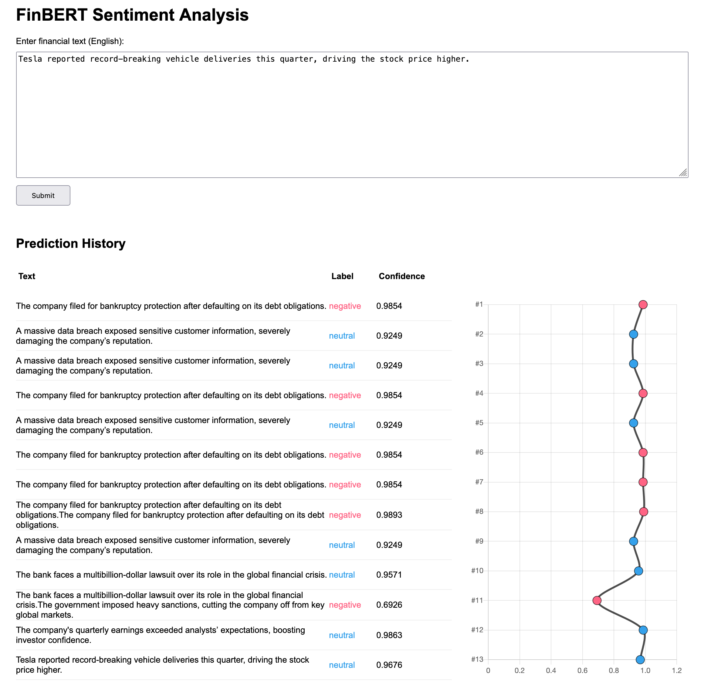

# Project Sentiment

A full-stack sentiment analysis application for financial news headlines using FinBERT. The project includes a Python backend for model inference and a Next.js frontend for user interaction.

## Features

- Sentiment analysis on financial text using FinBERT
- REST API powered by FastAPI
- Interactive web frontend built with Next.js
- Jupyter Notebook for data exploration and model evaluation

## Project Structure

```
.
├── sentiment/                # Python backend and analysis
│   ├── serve_api.py          # FastAPI app for sentiment prediction
│   ├── requirements.txt      # Python dependencies
├── finbert-sentiment/        # FinBERT model files
├── bert-sentiment/           # Alternative BERT model files
├── web/                      # Next.js frontend
│   ├── pages/                # Frontend pages (index.tsx, etc.)
│   ├── components/           # React components
│   ├── package.json          # Frontend dependencies
│   └── tsconfig.json         # TypeScript config
└── .gitignore                # Git ignore rules
```

## Getting Started

### Backend (Python/FastAPI)

1. **Install dependencies:**
    ```sh
    cd sentiment
    pip install -r requirements.txt
    ```

2. **Download/prepare FinBERT model:**
    - Place the model files in `finbert-sentiment/` (already ignored by git).

3. **Run the API server:**
    ```sh
    uvicorn serve_api:app --reload
    ```

### Frontend (Next.js)

1. **Install dependencies:**
    ```sh
    cd web
    npm install
    ```

2. **Run the development server:**
    ```sh
    npm run dev
    ```

3. **Open [http://localhost:3000](http://localhost:3000) in your browser.**

## Usage

- Enter financial news text in the web UI to get sentiment predictions.
- The backend API endpoint `/predict` accepts POST requests with text input and returns sentiment results.

## Web Frontend Preview




## Prebuilt FinBERT Model

The FinBERT model required for sentiment analysis is **not included in this repository** due to its large size and licensing constraints.  
Instead, we have prebuilt the FinBERT model and hosted it in a separate location.

> **Note:** Do not upload the FinBERT model files to this repository, as they are ignored by `.gitignore`.


## License

This project is for educational purposes. See individual files for third-party licenses.

---